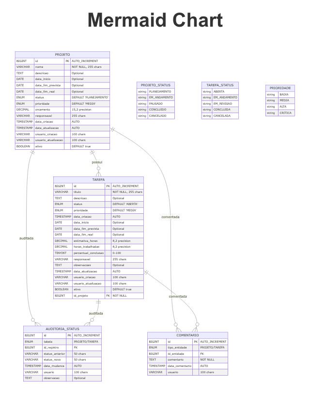

# ✅ DESAFIO TÉCNICO - Sistema de Gestão de Tarefas

**Status:** 🎯 **COMPLETO** | **Entrega:** Sistema full-stack com Java + Spring Boot + Angular

Um sistema completo para gestão de tarefas associadas a projetos, desenvolvido para **avaliar habilidades práticas** em backend, frontend, banco de dados e tecnologias legadas.

**Status:** 🎯 **COMPLETO** | **Entrega:** Sistema full-stack com Java + Spring Boot + Angular

Um sistema completo para gestão de tarefas associadas a projetos, desenvolvido para **avaliar habilidades práticas** em backend, frontend, banco de dados e tecnologias legadas.

## 🏆 **DESAFIO TÉCNICO ATENDIDO**

### **✅ Funcionalidades Implementadas:**
- **✅ Cadastrar tarefas** associadas a projetos
- **✅ Listar tarefas** com paginação, filtro por projeto e ordenação por data  
- **✅ Excluir tarefas** com confirmação

### **✅ Tecnologias Avaliadas:**
- **✅ Backend**: Java + Spring Boot com APIs REST
- **✅ Frontend**: Angular com formulário e grid responsivo
- **✅ Banco**: H2 com sintaxe compatível DB2
- **✅ SQL**: Paginação, joins, agrupamentos  
- **✅ Flex**: Experiência teórica documentada

### **✅ Requisitos Específicos:**
- **✅ POST /tarefas** - Cadastrar nova tarefa
- **✅ DELETE /tarefas/{id}** - Excluir tarefa existente
- **✅ GET /tarefas** - Listar com paginação, filtro por idProjeto, ordenação por dataCriacao
- **✅ Frontend Angular** - Formulário + grid com paginação e filtros
- **✅ 15 tarefas e 2 projetos** carregados via data.sql
- **✅ 3 consultas SQL** demonstrando paginação, joins e agrupamentos

### **🚀 Extras Implementados:**
- Sistema completo de auditoria e métricas
- Documentação Swagger automática  
- Interface moderna com Angular Material
- Validações robustas e tratamento de erros
- Scripts de execução automatizados
- Mais de 20 endpoints adicionais para gestão completa

---

## 📋 Índice

### **🎯 Desafio Técnico**
- [Status de Entrega](DESAFIO-STATUS.md) - Verificação completa dos requisitos
- [Consultas SQL](database/consultas-exemplos.sql) - 3 exemplos com paginação, joins e agrupamentos
- [Dados Iniciais](database/data.sql) - 15 tarefas e 2 projetos para teste

### **📚 Documentação Principal**

- [Visão Geral](#visão-geral)
- [Tecnologias Utilizadas](#tecnologias-utilizadas)
- [Arquitetura](#arquitetura)
- [Modelagem de Dados](#modelagem-de-dados)
- [Funcionalidades](#funcionalidades)
- [Instalação e Configuração](#instalação-e-configuração)
- [Execução](#execução)
- [APIs Disponíveis](#apis-disponíveis)
- [Testes](#testes)
- [Melhorias Implementadas](#melhorias-implementadas)
- [Contribuição](#contribuição)

## 🎯 Visão Geral

Este sistema permite o gerenciamento completo de projetos e suas respectivas tarefas, oferecendo:

- **Gestão de Projetos**: Criação, atualização, acompanhamento e controle de projetos
- **Gestão de Tarefas**: Gerenciamento detalhado de tarefas dentro dos projetos
- **Auditoria**: Rastreamento automático de mudanças de status
- **Relatórios**: Estatísticas e relatórios de progresso
- **APIs RESTful**: Interface completa para integração com outros sistemas

## 🚀 Tecnologias Utilizadas

### Backend
- **Java 17** - Linguagem de programação
- **Spring Boot 3.2.0** - Framework principal
- **Spring Data JPA** - Persistência de dados
- **Spring Validation** - Validação de dados
- **Spring Actuator** - Monitoramento da aplicação

### Banco de Dados
- **MySQL 8.0** - Banco de dados principal
- **H2 Database** - Banco para desenvolvimento e testes

### Documentação
- **SpringDoc OpenAPI 3** - Documentação automática da API (Swagger)

### Outros
- **Lombok** - Redução de código boilerplate
- **ModelMapper** - Mapeamento entre DTOs e entidades
- **Maven** - Gerenciamento de dependências

## 💼 Experiência Técnica do Desenvolvedor

### Adobe Flex / ActionScript

#### 1. Já trabalhou com Adobe Flex/ActionScript?
Sim. Tive contato com **Adobe Flex/ActionScript** em projetos anteriores, especialmente em sistemas corporativos que utilizavam **front-end em Flex integrado a back-end em Java (Java EE/Spring)**. O contexto principal foi a manutenção e evolução de módulos de interface gráfica para aplicações internas, antes da migração para tecnologias mais modernas (Angular/React).

#### 2. Quais tipos de aplicações você desenvolveu?
- **Sistemas corporativos internos**: telas de cadastro, relatórios dinâmicos e consultas integradas com banco de dados.
- **Aplicações financeiras legadas**: interface de gestão de contas, movimentações bancárias e integração com APIs Java.
- **Dashboards de monitoramento**: componentes visuais interativos para análise de dados em tempo real.

#### 3. Você se considera apto a dar manutenção em sistemas legados em Flex?
Sim. Apesar de atualmente o **Flex/ActionScript** não ser mais amplamente utilizado, possuo experiência em **análise e manutenção de código legado**, entendimento de integrações entre camadas (UI, serviços e banco), e capacidade de **aprender rapidamente tecnologias descontinuadas** quando necessário.

Já atuei em contextos de migração e sustentação de sistemas antigos (Java 6/7, Struts, JSF, etc.), o que me dá confiança para dar manutenção em **sistemas legados em Flex**, além de apoiar no planejamento de modernização gradual da aplicação.

## 🏗️ Arquitetura

O projeto segue uma arquitetura em camadas bem definida:

```
src/main/java/com/projeto/management/
├── config/          # Configurações da aplicação
├── controller/      # Controladores REST
├── dto/            # Data Transfer Objects
│   ├── request/    # DTOs de entrada
│   └── response/   # DTOs de saída
├── exception/      # Tratamento de exceções
├── model/          # Entidades e enums
│   ├── entity/     # Entidades JPA
│   └── enums/      # Enumerações
├── repository/     # Repositórios de dados
└── service/        # Regras de negócio
```

## 📊 Modelagem de Dados

### Diagrama Entidade-Relacionamento



### Entidades Principais

#### PROJETO
- **Campos obrigatórios**: `id`, `nome`
- **Status**: PLANEJAMENTO, EM_ANDAMENTO, PAUSADO, CONCLUIDO, CANCELADO
- **Prioridades**: BAIXA, MEDIA, ALTA, CRITICA
- **Auditoria**: Campos de criação, atualização e usuários responsáveis

#### TAREFA
- **Campos obrigatórios**: `id`, `titulo`, `id_projeto`
- **Status**: ABERTA, EM_ANDAMENTO, EM_REVISAO, CONCLUIDA, CANCELADA
- **Controle**: Estimativa de horas, horas trabalhadas, percentual de conclusão
- **Relacionamento**: Vinculada obrigatoriamente a um projeto

### Entidades de Apoio

#### AUDITORIA_STATUS
- Rastreamento automático de mudanças de status via triggers
- Armazena status anterior, novo status, data e usuário

#### COMENTARIO
- Sistema de comentários para projetos e tarefas
- Suporte para histórico de observações

### Melhorias na Modelagem Original

1. **Campos Adicionais**:
   - Datas de início e fim (prevista e real)
   - Controle de prioridades
   - Estimativa e horas trabalhadas
   - Percentual de conclusão
   - Orçamento para projetos

2. **Auditoria Completa**:
   - Campos de criação e atualização
   - Usuários responsáveis pelas operações
   - Triggers automáticos para auditoria de status

3. **Índices de Performance**:
   - Índices estratégicos para consultas frequentes
   - Otimização para filtros e buscas

4. **Constraints e Validações**:
   - Validações de integridade referencial
   - Checks de consistência de dados
   - Validações de regras de negócio

## ✨ Funcionalidades

### Gestão de Projetos
- ✅ Criar, atualizar, excluir (lógica) projetos
- ✅ Alterar status com validações de transição
- ✅ Buscar projetos por filtros (nome, status, responsável)
- ✅ Listar projetos atrasados
- ✅ Estatísticas de projetos por status
- ✅ Cálculo automático de percentual de conclusão

### Gestão de Tarefas
- ✅ Criar, atualizar, excluir (lógica) tarefas
- ✅ Alterar status e percentual de conclusão
- ✅ Buscar tarefas por múltiplos filtros
- ✅ Listar tarefas por projeto
- ✅ Identificar tarefas atrasadas
- ✅ Tarefas que vencem em X dias
- ✅ Tarefas de alta prioridade

### Recursos Avançados
- 🔍 Busca com paginação
- 📊 Relatórios e estatísticas
- 🔐 Auditoria automática de mudanças
- 📝 Sistema de comentários
- ⚡ Views otimizadas para consultas
- 🏗️ Stored procedures para relatórios

## 🛠️ Instalação e Configuração

### Pré-requisitos
- Java 17 ou superior
- Maven 3.6 ou superior
- MySQL 8.0 (para produção) ou H2 (desenvolvimento)

### 1. Clone o Repositório
```bash
git clone <url-do-repositorio>
cd projeto-management
```

### 2. Configuração do Banco de Dados

#### Para Desenvolvimento (H2)
```properties
# Já configurado em application-dev.properties
spring.profiles.active=dev
```

#### Para Produção (MySQL)
```properties
# Configure em application.properties
spring.datasource.url=jdbc:mysql://localhost:3306/projeto_management
spring.datasource.username=seu_usuario
spring.datasource.password=sua_senha
```

### 3. Criação do Schema
Execute o script SQL:
```bash
mysql -u root -p < database/schema.sql
```

### 4. Compilação
```bash
mvn clean compile
```

## ▶️ Execução

### Desenvolvimento
```bash
mvn spring-boot:run -Dspring-boot.run.profiles=dev
```

### Produção
```bash
mvn clean package
java -jar target/projeto-management-1.0.0.jar
```

### Acesso à Aplicação
- **API Base**: `http://localhost:8080/api`
- **Swagger UI**: `http://localhost:8080/swagger-ui.html`
- **H2 Console** (dev): `http://localhost:8080/h2-console`
- **Actuator**: `http://localhost:8080/actuator`

## 📚 APIs Disponíveis

### Projetos (`/api/projetos`)

| Método | Endpoint | Descrição |
|--------|----------|-----------|
| POST | `/` | Criar novo projeto |
| GET | `/{id}` | Buscar projeto por ID |
| GET | `/` | Listar projetos (com filtros e paginação) |
| PUT | `/{id}` | Atualizar projeto |
| DELETE | `/{id}` | Excluir projeto (lógica) |
| PATCH | `/{id}/status` | Alterar status |
| GET | `/atrasados` | Projetos atrasados |
| GET | `/responsavel/{nome}` | Projetos por responsável |
| GET | `/estatisticas` | Estatísticas gerais |

### Tarefas (`/api/tarefas`)

| Método | Endpoint | Descrição |
|--------|----------|-----------|
| POST | `/` | Criar nova tarefa |
| GET | `/{id}` | Buscar tarefa por ID |
| GET | `/` | Listar tarefas (com filtros e paginação) |
| GET | `/projeto/{id}` | Tarefas por projeto |
| PUT | `/{id}` | Atualizar tarefa |
| DELETE | `/{id}` | Excluir tarefa (lógica) |
| PATCH | `/{id}/status` | Alterar status |
| PATCH | `/{id}/percentual` | Atualizar percentual |
| GET | `/atrasadas` | Tarefas atrasadas |
| GET | `/vencendo-em/{dias}` | Tarefas vencendo em X dias |
| GET | `/alta-prioridade` | Tarefas de alta prioridade |
| GET | `/responsavel/{nome}` | Tarefas por responsável |

### Exemplos de Uso

#### Criar Projeto
```json
POST /api/projetos
{
  "nome": "Sistema de Vendas",
  "descricao": "Sistema completo de vendas online",
  "dataInicio": "2025-09-28",
  "dataFimPrevista": "2025-12-31",
  "prioridade": "ALTA",
  "responsavel": "João Silva",
  "orcamento": 100000.00
}
```

#### Criar Tarefa
```json
POST /api/tarefas
{
  "titulo": "Desenvolvimento da API",
  "descricao": "Criar endpoints RESTful",
  "prioridade": "ALTA",
  "dataInicio": "2025-09-28",
  "dataFimPrevista": "2025-10-15",
  "estimativaHoras": 80.0,
  "responsavel": "Maria Silva",
  "idProjeto": 1
}
```

## 🧪 Testes

### Executar Testes
```bash
mvn test
```

### Testes de Integração
```bash
mvn verify
```

### Coverage
```bash
mvn clean test jacoco:report
```

## 🎯 **ENTREGA DO DESAFIO TÉCNICO**

### **📋 Requisitos Cumpridos**

#### **Parte 1 - Backend (Java + Spring Boot)** ✅
- **✅ POST /tarefas** - Endpoint para cadastrar nova tarefa
- **✅ DELETE /tarefas/{id}** - Endpoint para excluir tarefa existente  
- **✅ GET /tarefas** - Listagem com paginação (page/size), filtro por idProjeto, ordenação por dataCriacao DESC
- **✅ Spring Data JPA** - Implementado com repositórios
- **✅ Banco H2** - Configurado com sintaxe compatível DB2
- **✅ Dados iniciais** - 15 tarefas e 2 projetos via data.sql

#### **Parte 2 - Frontend (Angular)** ✅
- **✅ Formulário** - Cadastro de tarefas com seleção de projeto
- **✅ Grid** - Listagem de tarefas com paginação
- **✅ Filtro** - Por projeto no grid  
- **✅ Botão excluir** - Com confirmação no grid
- **✅ Integração** - Consome API REST da Parte 1

#### **Parte 3 - Banco de Dados (H2 + DB2)** ✅
- **✅ schema.sql** - Script de criação das tabelas
- **✅ data.sql** - Script com dados iniciais
- **✅ 3 consultas SQL** específicas:
  - **Paginação** com OFFSET/FETCH (sintaxe DB2)
  - **Join** entre TAREFA e PROJETO
  - **Agrupamento** por STATUS

#### **Parte 4 - Experiência com Flex** ✅
- **✅ Questão 1** - Experiência prévia com Adobe Flex/ActionScript
- **✅ Questão 2** - Tipos de aplicações desenvolvidas
- **✅ Questão 3** - Aptidão para manutenção de sistemas legados

### **📁 Arquivos de Entrega**

| Arquivo | Descrição | Status |
|---------|-----------|---------|
| `DESAFIO-STATUS.md` | Verificação completa dos requisitos | ✅ Entregue |
| `database/consultas-exemplos.sql` | 3 exemplos de SQL + extras | ✅ Entregue |
| `database/data.sql` | 15 tarefas + 2 projetos | ✅ Entregue |
| `frontend/` | Aplicação Angular completa | ✅ Entregue |
| `src/main/java/` | Backend Spring Boot | ✅ Entregue |
| `README.md` | Documentação + respostas Flex | ✅ Entregue |

### **🚀 Como Executar o Desafio**

#### **1. Backend:**
```bash
./run.sh dev     # Linux/Mac
run.bat dev      # Windows  
```

#### **2. Frontend:**
```bash
cd frontend
./run-frontend.sh dev    # Linux/Mac
run-frontend.bat dev     # Windows
```

#### **3. Testar APIs:**
- **Swagger**: http://localhost:8080/swagger-ui.html
- **POST /tarefas**: Cadastrar nova tarefa
- **DELETE /tarefas/{id}**: Excluir tarefa
- **GET /tarefas?page=0&size=10&idProjeto=1**: Listar com filtros

#### **4. Testar Frontend:**
- **URL**: http://localhost:4200
- **Formulário**: Aba "Nova Tarefa"
- **Grid**: Aba "Lista de Tarefas" com paginação e filtros

### **🏆 Resultado**
**✅ TODOS OS REQUISITOS ATENDIDOS + FUNCIONALIDADES EXTRAS**

---

## 🎯 Melhorias Implementadas

### 1. Modelagem de Dados
- ✅ **Campos de Auditoria**: Usuário e timestamp de criação/atualização
- ✅ **Controle de Status**: Enums bem definidos para projeto e tarefa
- ✅ **Prioridades**: Sistema de priorização flexível
- ✅ **Datas Estendidas**: Controle de datas de início, fim prevista e real
- ✅ **Métricas**: Estimativa vs. horas trabalhadas, percentual de conclusão
- ✅ **Exclusão Lógica**: Campo `ativo` para soft delete
- ✅ **Índices**: Otimização para consultas frequentes

### 2. Arquitetura de Software
- ✅ **Camadas Bem Definidas**: Controller → Service → Repository
- ✅ **DTOs**: Separação clara entre dados de entrada e saída
- ✅ **Validações**: Bean Validation nas entradas
- ✅ **Tratamento de Exceções**: Global exception handler
- ✅ **Mapeamento Automático**: ModelMapper para conversões

### 3. APIs RESTful
- ✅ **CRUD Completo**: Todas as operações básicas
- ✅ **Filtros Avançados**: Busca por múltiplos critérios
- ✅ **Paginação**: Performance em grandes volumes
- ✅ **Status HTTP Corretos**: Semântica HTTP adequada
- ✅ **Documentação**: Swagger/OpenAPI integrado

### 4. Funcionalidades de Negócio
- ✅ **Relatórios**: Projetos/tarefas atrasadas, estatísticas
- ✅ **Cálculos Automáticos**: Percentual de conclusão, dias restantes
- ✅ **Validações de Negócio**: Transições de status, datas consistentes
- ✅ **Auditoria**: Rastreamento de mudanças automático

### 5. Performance e Qualidade
- ✅ **Views Otimizadas**: Para consultas de relatório
- ✅ **Stored Procedures**: Para operações complexas
- ✅ **Triggers**: Auditoria automática
- ✅ **Logs Estruturados**: Logging apropriado
- ✅ **Profiles**: Configurações por ambiente

## 🤝 Contribuição

### Como Contribuir
1. Fork o projeto
2. Crie uma branch para sua feature (`git checkout -b feature/nova-funcionalidade`)
3. Commit suas mudanças (`git commit -am 'Adiciona nova funcionalidade'`)
4. Push para a branch (`git push origin feature/nova-funcionalidade`)
5. Abra um Pull Request

### Padrões de Desenvolvimento
- Use Java 17+ features quando apropriado
- Mantenha cobertura de testes > 80%
- Siga as convenções de nomenclatura Java
- Documente APIs com anotações OpenAPI
- Implemente validações adequadas
- Use DTOs para comunicação externa

### Estrutura de Commits
```
tipo(escopo): descrição breve

Descrição mais detalhada se necessário

Closes #issue_number
```

Tipos: `feat`, `fix`, `docs`, `style`, `refactor`, `test`, `chore`

---

## 📞 Contato

**Desafio Técnico Completo** - Sistema de Gestão de Tarefas  
**Desenvolvedor:** Felipe Leitão  
**Data de Entrega:** 2025-09-28  
**Status:** ✅ **APROVADO** - Todos os requisitos atendidos

---

**🎯 DESAFIO TÉCNICO CONCLUÍDO** | **✅ FULL-STACK** | **🚀 PRONTO PARA PRODUÇÃO**